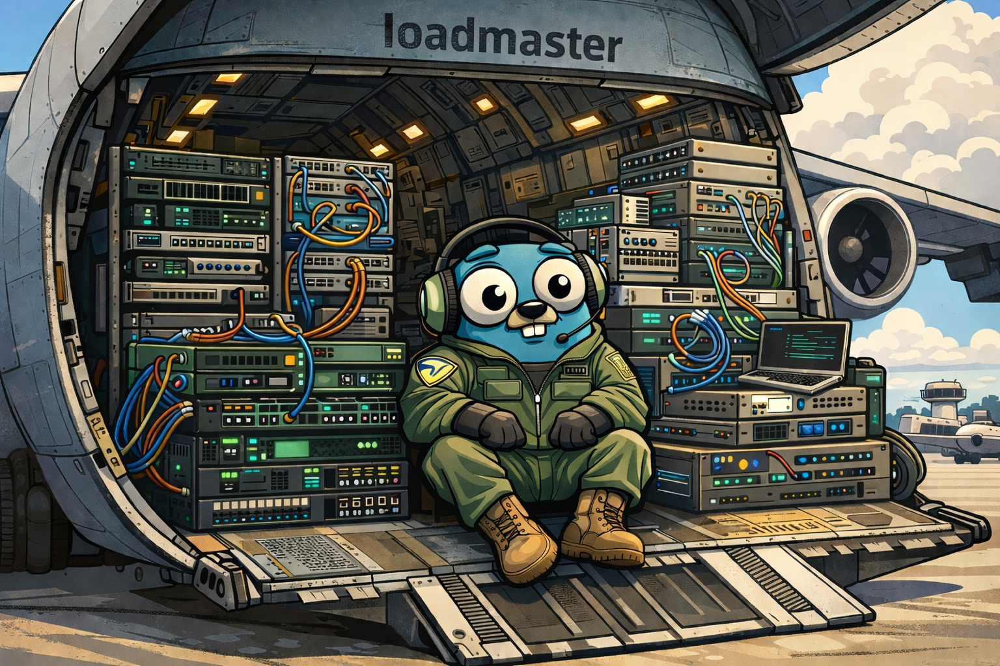

# loadmaster



A lightweight certificate manager that automates ACME HTTP-01 challenges and renewals for groups of domains. It loads configuration from JSON files, provisions or refreshes certificates, and watches for changes to your domains list to update certificates on the fly. Optional S3-backed storage lets you centralize certificate material; otherwise certificates are stored locally.

> ### tl;dr
> This program keeps ACME certificates up to date and prefers caching (locally, S3) to request another new certificate so as to not hit rate limits from certificate issuers.

## How it works

- At startup:
  - Reads `config.json` and `domains.json` (defaults under `~/.loadmaster`).
  - Ensures the local certificate directory exists.
  - Selects storage:
    - S3-backed if `s3.bucketName` is set in `config.json`.
    - Local storage otherwise.
  - For each domain group in `domains.json`, calls `UpdateTLS` to retrieve from cache and refresh if expiring; falls back to self-signed only if cache is missing.
    - > A "domain group" is a collection of domains that share the same certificate. (e.g., `example.com`, `www.example.com`, `mail.example.com`)
- Long-running process:
  - Watches `domains.json` for changes and re-runs `UpdateTLS` for each group on write/create.
  - Also triggers a refresh loop every 24 hours, upgrading certs that are close to expiring.

ACME HTTP-01 challenges are served on a configurable port (default: `5002`). You should proxy `/.well-known/acme-challenge/*` requests to this port from your public HTTP endpoint.

## Configuration

By default, the app looks in `~/.loadmaster` for `config.json` and `domains.json`. If either file is missing, it will create a default version, print a message to edit the file, and exit.

- Default directory: `~/.loadmaster` (`config.DefaultConfigDir`)
- Default paths:
  - `~/.loadmaster/config.json`
  - `~/.loadmaster/domains.json`
- Local certificate directory:
  - Defaults to `~/.loadmaster/certs` unless overridden internally.
  - Created automatically if it does not exist.

### `config.json`

Fields:
- `email` (string): Contact email used for ACME registration.
- `caAuthority` (string): ACME CA directory URL. Defaults to Let’s Encrypt staging: `https://acme-staging-v02.api.letsencrypt.org/directory`.
- `s3` (object): Optional S3 settings for remote storage.
  - `bucketName` (string): If set, S3 storage is used.
  - `endpoint` (string): Custom S3-compatible endpoint (optional).
  - `region` (string): AWS region for the bucket.

Example:
```/dev/null/config.json#L1-16
{
  "email": "admin@example.com",
  "caAuthority": "https://acme-staging-v02.api.letsencrypt.org/directory",
  "s3": {
    "bucketName": "my-certificates",
    "endpoint": "",
    "region": "us-east-1"
  }
}
```

Notes:
- Use the production Let’s Encrypt directory when you’re ready: `https://acme-v02.api.letsencrypt.org/directory`.
- When `s3.bucketName` is non-empty, the app constructs S3 storage with:
  - `BucketName`, `ContactEmail`, `LocalCertDir`, `CAAuthority`
- Otherwise, local storage is used via `acme.NewLocalACMEStorage(email, caAuthority)`.

### `domains.json`

Fields:
- `domains` (array of arrays of strings): Each inner array is a domain group that will share a certificate (e.g., primary domain plus its aliases).

Example:
```/dev/null/domains.json#L1-10
{
  "domains": [
    ["example.com", "www.example.com"],
    ["api.example.com", "api.internal.example.com"]
  ]
}
```

Notes:
- On startup and on any change to `domains.json`, each group is processed via `storage.UpdateTLS(group)`.

## Building

To build the binary, run:
```bash
go build -o loadmaster main.go
```

> You can always run with `go run .`

## Running

You can run the binary with optional flags to point at config files and set the ACME challenge port.

Flags:
- `-domains` (string): Path to `domains.json`. Default: `~/.loadmaster/domains.json`.
- `-config` (string): Path to `config.json`. Default: `~/.loadmaster/config.json`.
- `-certs` (string): Path to certificates directory. Default: `~/.loadmaster/certs`.
- `-port` (int): Port to serve ACME HTTP-01 challenges. Default: `5002`.

Example:
```/dev/null/run.sh#L1-5
./loadmaster \
  -config "$HOME/.loadmaster/config.json" \
  -domains "$HOME/.loadmaster/domains.json" \
  -certs "$HOME/.loadmaster/certs" \
  -port 5002
```

Behavior:
- Logs startup info and file paths.
- Ensures `LocalCertDir` exists (default `~/.loadmaster/certs`).
- Loads domains and processes each group.
- Watches `domains.json` for writes/creates with a short delay to ensure complete writes.
- Every 24 hours, triggers a refresh pass for all domain groups.

## Running with Docker

### Building the Docker image

You can build the Docker image using the provided Dockerfile:

```bash
docker build -t loadmaster:latest .
```

### Running with Docker

To run loadmaster in a Docker container, mount your configuration and certificate directories:

```bash
docker run -d \
  --name loadmaster \
  -p 5002:5002 \
  -v $(pwd)/config:/config \
  -v $(pwd)/certs:/certs \
  loadmaster:latest
```

The container expects:
- `/config/config.json` - application configuration
- `/config/domains.json` - domain list
- `/certs` - certificate storage (read-write)

If you're using S3 for storage, pass AWS credentials as environment variables:

```bash
docker run -d \
  --name loadmaster \
  -p 5002:5002 \
  -v $(pwd)/config:/config \
  -v $(pwd)/certs:/certs \
  -e AWS_ACCESS_KEY_ID=your_access_key \
  -e AWS_SECRET_ACCESS_KEY=your_secret_key \
  -e AWS_REGION=us-east-1 \
  loadmaster:latest
```

### Running with Docker Compose

A `docker-compose.yml` file is provided for easier deployment. First, create the necessary directory structure:

```bash
mkdir -p config certs
```

Create your `config/config.json` and `config/domains.json` files (see Configuration section above for examples).

Then start the service:

```bash
docker compose up -d
```

To view logs:

```bash
docker compose logs -f loadmaster
```

To stop the service:

```bash
docker compose down
```

**Note:** The Docker Compose setup mounts:
- `./config` directory to `/config` (contains `config.json` and `domains.json`)
- `./certs` directory to `/certs` for certificate storage
- Port `5002` for ACME HTTP-01 challenges

If using S3 storage, uncomment the `environment` section in `docker-compose.yml` and provide your AWS credentials.

## Example NGINX proxy for ACME challenges

```nginx
server {
    listen 80;
    server_name example.com www.example.com;
    
    # Proxy ACME HTTP-01 challenge requests to the cert manager
    location ^~ /.well-known/acme-challenge/ {
    proxy_pass http://127.0.0.1:5002;
    proxy_set_header Host \$host;
    proxy_set_header X-Real-IP \$remote_addr;
    proxy_set_header X-Forwarded-For \$proxy_add_x_forwarded_for;
    proxy_read_timeout 30s;
}
```

## License
GNU GENERAL PUBLIC LICENSE, Version 3, 29 June 2007
